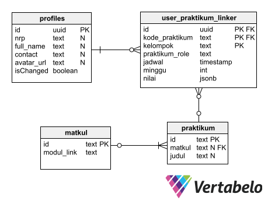

# Website Penilaian dan Penjadwalan Praktikum Fisika ITS

Website ini digunakan untuk penilaian dan penjadwalan praktikum mata kuliah Fisika Laboratorium 1 dan 2 pada Prodi S1 Departemen Fisika ITS.

Praktikum dilaksanakan dengan rekrutmen asisten secara terbuka, serta mengelompokkan praktikan berjumlah sekitar 10 orang berdasarkan mata kuliahnya. Praktikum dilaksanakan seminggu sekali untuk tiap mata kuliah dengan urutan judul yang ditentukan di awal. Tiap mata kuliah yang dipraktikumkan memiliki modul yang bisa diakses oleh praktikan. Dimungkinkan asisten pada mata kuliah Fisika Laboratorium 1 juga menjadi praktikan pada mata kuliah Fisika Laboratorium 2. Karena perbedaan target angkatan pada tiap mata kuliah.

Dari hal tersebut, dibentuklah struktur database seperti berikut (belum termasuk skema user dan storage dari Supabase)



## Goal / MVP

1. Dengan Supabase, `user` bisa sign-in melalui NRP dan password yang sama dengan NRP, lalu bisa diganti di lain waktu.
2. `user` punya role `praktikan` dan atau `aslab` yang diinput secara manual oleh admin. Role bisa salah satu atau keduanya. Perpindahan role **HARUS** bisa dilakukan tanpa log-out terlebih dahulu.
3. Praktikan punya `kelompok` praktikum yang jadwalnya ditentukan aslab.
4. Kelompok praktikum punya nama yang merepresentasikan matkul (FL1-01 atau FL2-14).
5. Praktikan bisa gabung beberapa kelompok sekaligus.
6. Kelompok praktikum punya praktikum-praktikum yang harus dijalankan, dengan urutan praktikum yang berbeda tiap kelompoknya
7. Praktikan punya `nilai` yang mendetail dengan tiap bagian praktikum atau lapresnya (pre-lab, in-lab, abstrak, pendahuluan, metodologi, dsb).
8. Aslab bisa mengisi nilai pada tiap praktikum yang dihandle.
9. Modul bisa diakses pada web, yang menuju ke tautan Google Drive.

## Penyiapan Database (Supabase)

Buat *project* Supabase free tier dengan menggunakan region **Singapura**. Setelah selesai, masuk ke bagian SQL Editor dan Jalankan tiap file SQL yang ada pada folder `/supabase` secara berurutan.

## Pengisian Database

Ekstrak zip yang ada pada folder `/supabase/populate` dan pindahkan ke tempat lain (selain di folder Proyek Next.js ini)

1. Buat semua file csv yang dibutuhkan dengan struktur yang sama dengan yang ada pada folder `./data` di Google Sheet atau yang lain, lalu rename sesuai yang ada pada folder `./data`.
   - Satu kelompok praktikum hanya punya satu asla pada tiap judulnya
   - Aslab harus punya nomor yang bisa dihubungi
2. Jalankan `npm install`, pastikan anda telah menginstall Node.js.
3. Buat file `.env` yang berisi
   ```
   SUPABASE_URL = your_supabase_url
   SERVICE_ROLE = your_service_role_key
   ```
4. Jalankan `node 1-first.js`
5. Jalankan `node 2-linker.js`

Tools yang lain : 
- `changeMinggu.js` untuk mengganti minggu pada judul praktikum. Hindari penggantian beruntun, misal 8 diganti 9, lalu 9 diganti 10, semua akan jadi 10, padahal harusnya 8 dan 9 diganti menjadi 9 dan 10.
- `getNilai.js` Mendapatkan nilai praktikum dan mengunggahnya pada Google Sheet
- `linkerResetNilaiAman.js` untuk reset apabila ada kesalahan pada `changeMinggu.js`. Pastikan data csv sama dengan data yang sudah ada pada database
- `pwReset.js` Untuk melakukan reset password (NRP)
- `resetLinker.js` untuk menghapus semua baris yang ada pada tabel linker

## Routing Website

1. Login Page `/login`. Bila telah masuk, redirect ke `/`
2. `/praktikan` adalah halaman untuk praktikan dengan tampilan default adalah praktikum (judul, kode dan nilai), aslab, aslab yang bisa dihubungi serta modul yang unified
3. `/aslab` adalah halaman awal dari aslab dengan tampilan kelompok praktikum (kode), judul praktikum dan link menuju halaman penilaian
4. `/aslab/%kelompok/%praktikum` adalah halaman penilaian dengan masing-masing mahasiswa (Nama, NRP dan foto mahasiswa)
5. `/jadwal` untuk melihat okupansi lab pada seluruh jadwal praktikum dalam satu minggu
6. Jika user masuk ke halaman yang tidak diizinkan (contoh: asisten masuk ke halaman kelompok yang tidak diasisteni) maka akan menampilkan pesan 404, `/404`

## Pengembangan Lokal

Proyek ini telah mengkonfigurasi Supabase Auth untuk menggunakan kuki (cookies), yang menjadikan sesi login pengguna bisa digunakan pada seluruh aplikasi Next.js, baik itu Client Components, Server Components, Route Handlers, Server Actions dan Middleware. Bagaimana menggunakannya?

1. Gandakan repositori ini dengan `git clone https://github.com/jhagas/web-praktikum-fislab`.
2. Gunakan `cd` untuk memindah terminal ke direktori aplikasi ini.
3. Jalankan `npm install` untuk menginstall dependensi.
4. Buat file `.env.local` dan isikan nilai untuk `NEXT_PUBLIC_SUPABASE_URL` dan `NEXT_PUBLIC_SUPABASE_ANON_KEY` dari [Supabase project's API settings](https://app.supabase.com/project/_/settings/api).
5. Jalankan `npm run dev` untuk memulai server pengembangan lokal.

## Deployment

Repositori ini adalah proyek Next.js dengan App Routes, sehingga anda bisa menggunakan repository ini dan melakukan deploy di Vercel (rekomendasi) atau provider lain yang mendukung Next.js. Masukkan Environtment Variable yang sama dengan yang ada pada bagian Local Development poin 4.

